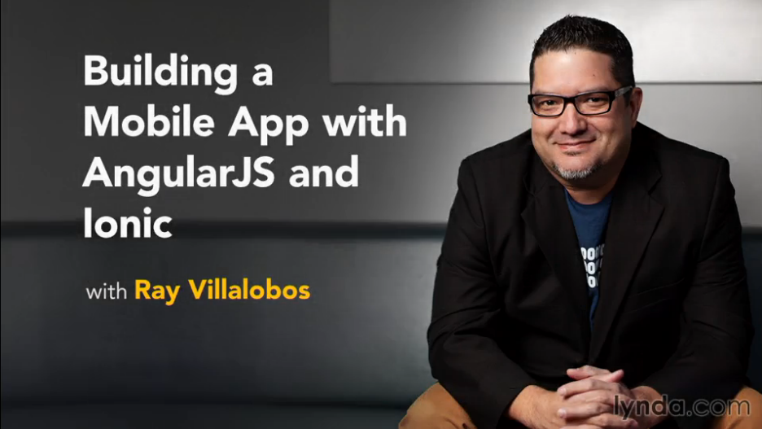

# Building a Mobile App with AngularJS and Ionic

This is the repository for my course, [Building a Mobile App with AngularJS and Ionic](http://www.lynda.com/AngularJS-tutorials/Building-Mobile-App-AngularJS-Ionic/368920-2.html). The full course is available at [lynda.com](http://lynda.com).

## Course Description
Creating hybrid mobile applications is a great way to leverage your knowledge of web languages like HTML5, CSS, and JavaScript. Modern frameworks such as AngularJS and Ionic make it easier with pre-built templates and components. In this course, staff author Ray Villalobos shows how to install the Ionic framework and set up a development environment suitable for building web-based apps. He reviews the core Ionic components: prebuilt, easy-to-use features such as buttons, lists, tabs, and forms. Then Ray shows how to combine these components with Angular.js models, views, and controllers to build a single page app with sliders, pull-to-refresh functionality, and search. The training culminates in building a multi-page app, which you'll learn how to customize with CSS.

## Topics include:
- Installing the development environment on Mac or PC
- Understanding the Ionic templates and CSS components
- Adding IonicIcons to a layout
- Adding tabs, cards, and lists
- Using form elements
- Building a single view app
- Implementing Pull to Refresh
- Creating a multi-tab app
- Styling the applications
- Deploying applications

## Instructions
This repository has branches for each of the videos in the course. You can use the branch pop up menu in github to switch to a specific branch and take a look at the course at that stage. Or you can simply add `/tree/BRANCH_NAME` to the URL to go to the branch you want to peek at.

1. Make sure you have these installed
	- [node.js](http://nodejs.org/)
	- [git](http://git-scm.com/)
	- [gulp](http://gulpjs.com/)
2. Clone this repository into your local machine using the terminal (mac) or Gitbash (PC) `> git clone https://github.com/planetoftheweb/angularMobile.git`
3. CD to the folder `cd angularMobile`
4. Run `> npm-install` to install the project dependencies
5. Install gulp.js via the Mac terminal or Gitbash on a PC `> npm install -g gulp`
5. Run the Gulp command `> gulp`

For more help setting up a comprehensive Gulp.js workflow, check out [Web Project Workflows with Gulp.js, Git, and Browserify](http://www.lynda.com/Web-Web-Design-tutorials/Web-Project-Workflows-Gulpjs-Git-Browserify/154416-2.html).

## More Stuff
Check out some of my [other courses on lynda.com](http://lynda.com/rayvillalobos). You can also check out my [youtube channel](http://youtube.com/planetoftheweb), [follow me on twitter](http://twitter.com/planetoftheweb), or read [my blog](http://raybo.org).
